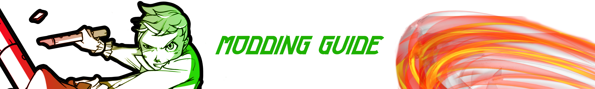
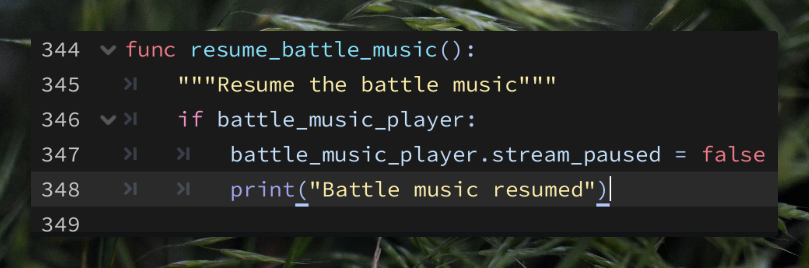
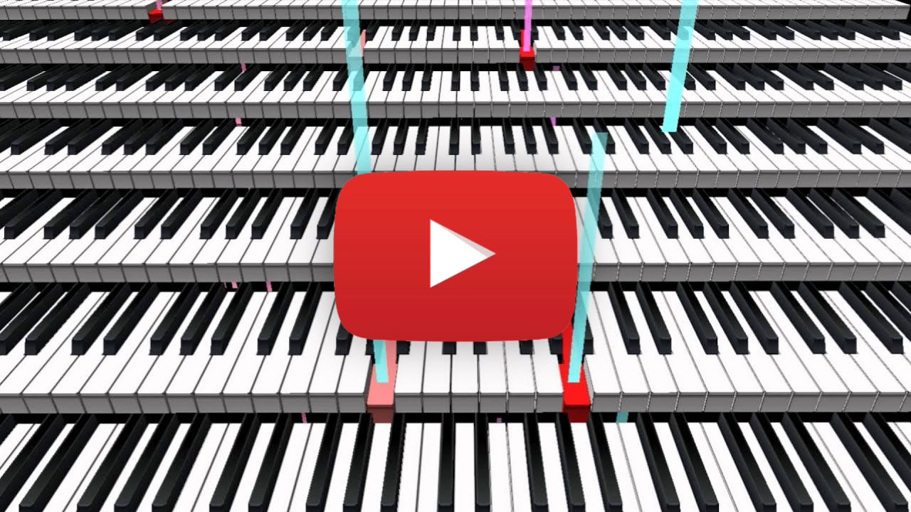
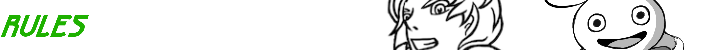
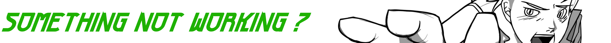
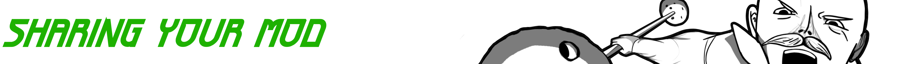
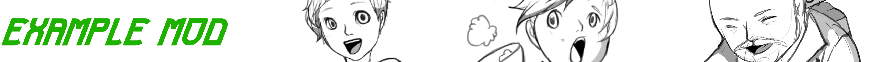

# [GAME NAME] Modding Guide

You can change the battle music in [GAME NAME]. No tools needed. No code needed.
You add files to a folder. The game finds them at startup.

This is version 1 of modding. More categories (sprites, characters) will come later.



<br>


## YouTube Video Tutorial

Watch this to get an idea of how to mod this game. Have fun!

<!-- [](https://www.youtube.com/watch?v=_cNIwKx5JDE) -->

<br>

<a href="https://www.youtube.com/watch?v=_cNIwKx5JDE">
  
</a>

### TIMECODE
[0:27](https://www.youtube.com/watch?v=_cNIwKx5JDE&t=27s) dropdown menu \
[1:45](https://www.youtube.com/watch?v=_cNIwKx5JDE&t=105s) adding a music file \
[3:12](https://www.youtube.com/watch?v=_cNIwKx5JDE&t=192s) testing your mod in-game \
[5:08](https://www.youtube.com/watch?v=_cNIwKx5JDE&t=308s) sharing your mod

<br>


## Quick start: replace the battle music

**1. Find the mods folder.**

The game makes this folder the first time you run it:

- **Windows:** `%APPDATA%\Godot\app_userdata\[GAME NAME]\mods\`
- **Mac:** `~/Library/Application Support/Godot/app_userdata/[GAME NAME]/mods/`
- **Linux:** `~/.local/share/godot/app_userdata/[GAME NAME]/mods/`

**2. Make your mod folder.**

Inside `mods/`, make a folder with any name, then a `music/` folder inside it:

```
mods/
  my_first_mod/
    music/
      battle_01_fight.mp3
```

The pattern is always: `mods/` → your mod's name (your choice) → category
folder (fixed names like `music/`) → files named after what they replace.

**3. Name your file after the clip you want to replace.**

The first battle has 4 music clips. A file with the same name replaces that clip:

| Filename | When it plays | BPM | Key | Notes |
|---|---|---|---|---|
| `battle_01_start.mp3` | battle opens | [BPM] | [KEY] | |
| `battle_01_intro.mp3` | before the fight | [BPM] | [KEY] | |
| `battle_01_fight.mp3` | main combat | [BPM] | [KEY] | plays the longest |
| `battle_01_end.mp3` | match end | [BPM] | [KEY] | |

You can replace one clip, or all four.

**4. Restart the game.** Your music plays in the battle.

<br>



## Rules

- Formats: `.mp3`, `.ogg`, or `.wav`
- Your track **loops**. A clip can play for 20 seconds or 5 minutes — it depends
  on the fight. Make sure the end flows back into the start.
- The game switches clips at story moments, not at track ends. Your durations
  do not need to match the originals.
- Any other filename loads as a new track with that name. It does not replace
  anything yet. Future features will use these.
- Exact spelling matters. `battle_01_fight.mp3` works. `Battle_01_Fight.mp3`
  does not.

<br>



## Something not working?

Open `mods/mod_log.txt` (next to your mod folder). Every file is listed there:

```
LOADED  my_first_mod/music/battle_01_fight.mp3 → music "battle_01_fight"
SKIPPED my_first_mod/music/notes.txt — not a supported audio format (.ogg, .mp3, .wav)
```

A skipped file never breaks the game. The game just plays its own music for
that clip.

<br>



## Sharing your mod

Zip your mod folder (`my_first_mod/`) and share it anywhere. To install
someone's mod: unzip it into `mods/` and restart the game.

To remove a mod: move its folder out of `mods/` (or delete it) and restart.
Renaming the folder does nothing — any folder inside `mods/` loads, whatever
its name.

[GAME NAME] is licensed [CC LICENSE]. Mods are yours.

<br>



## Example mod

Download [example_music_pack.zip](https://github.com/waltribeiro/github-mods/raw/main/examples/example_music_pack.zip) — a working mod with the correct
folder structure. Unzip it into `mods/`, restart, and hear it. Then swap in
your own files.

<br>


## Coming later

- Character sprite replacement
- Custom translations
- New fighters

Questions or ideas: [LINK TO ISSUES / DISCORD]